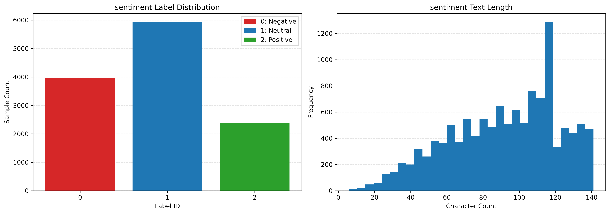

# KKU'3S Sentiment Analysis Project

**Course:** CP388 302 — Software Development and Project Management for Data Science and Artificial Intelligence  
**Project:** KKU'3S Sentiment Analysis  
**Milestone:** Milestone #1  
**Team Members:** Wu Xun, Muhammad Yahyaa, Tor  
**Status:** In Progress

---

## 1. Project Introduction

This is a group course project supporting the **KKU'3S campus second-hand trading platform**.

KKU'3S stands for **Seek, Share, and Swap**. It is designed as a campus-exclusive second-hand trading platform for the Khon Kaen University community, supporting activities such as item publishing, item search, online negotiation, transaction processing, user comments, reviews, and platform content management.

The sentiment analysis subsystem is intended to identify emotional tendencies in user-generated text using three sentiment classes:

- **Negative**
- **Neutral**
- **Positive**

The project evaluates multiple sentiment classification models using the **TweetEval** benchmark, compares their behavior and performance, and determines whether a candidate model should replace the current on-production model for future integration into the KKU'3S platform.

---

## 2. Business Context

User comments, reviews, and public posts generated on KKU'3S can provide important information about transaction experience, seller reputation, and platform-related issues.

The sentiment analysis subsystem supports three main business values:

### 2.1 Content Risk Control
Identify negative complaints and potentially problematic user feedback so that platform administrators can prioritize review and handling.

### 2.2 Seller Reputation Quantification
Aggregate sentiment from transaction reviews and comments to provide a more structured indication of seller reputation.

### 2.3 User Experience Improvement
Analyze user sentiment related to platform services, trading rules, product categories, and transaction experiences to support future platform improvement.

For more details, see the [Business Requirement Document](docs/business_requirement.md).

---

## 3. Stakeholders and Target Market

| Category | Definition |
|---|---|
| **Customer / Purchasing Party** | Administrative Department of Khon Kaen University and platform operation administrators |
| **End Users** | KKU students, teachers, certified campus merchants, and on-campus housing landlords |
| **Target Market Segment** | Campus second-hand / idle commodity trading market |
| **Primary AI Users** | Platform administrators and downstream platform services that consume sentiment predictions |

The evaluation criteria should reflect these stakeholder needs. In particular, the model should perform consistently across sentiment classes and should avoid missing important negative feedback.

---

## 4. Milestone #1 Objectives

Milestone #1 focuses on understanding the problem, defining evaluation criteria, exploring the dataset, and preparing the model-selection process.

The team is expected to:

1. Define product features, targeted customers, end users, and market segment.
2. Decide on the proposed **Ready-to-Ship** criteria.
3. Explore the **TweetEval** benchmark dataset and the assigned Hugging Face sentiment models.
4. Perform EDA, statistical analysis, data cleansing, and data preparation as needed.
5. Choose candidate models and explain the model-selection rationale.
6. Define the metrics used to measure and monitor model performance.
7. Set up **Weights & Biases (W&B)** and the team GitHub repository.

---

## 5. Dataset and Primary Classification Task

### 5.1 TweetEval

The project uses the **TweetEval Sentiment Dataset** as the common benchmark for model comparison.

All selected models are evaluated on the same test set to keep the comparison consistent and reproducible.

### 5.2 Primary Task — 3-Class Sentiment Classification

The main task predicts:

- **Negative**
- **Neutral**
- **Positive**

This 3-class setting is the primary evaluation setting used for the current team-level model comparison.

---

## 6. Exploratory Data Analysis and Data Preparation

The current workflow includes:

- Inspecting TweetEval train, validation, and test splits.
- Checking sentiment label distributions.
- Examining class imbalance.
- Reviewing tweet length and text characteristics.
- Preparing model-compatible tokenization.
- Normalizing Twitter-specific text patterns when required.
- Inspecting class-level behavior and misclassification patterns.

Because the sentiment classes are not equally distributed, **overall Accuracy alone is not sufficient** for model selection. Macro-averaged and class-level metrics are therefore emphasized.

### Current EDA Visualization



---

## 7. Model Evaluation Strategy

The course specifies two reference models:

| Role | Model | Purpose |
|---|---|---|
| **Baseline Model** | `cardiffnlp/twitter-roberta-base-sentiment-latest` | Baseline for sentiment performance comparison |
| **Current On-Production Model** | `LYTinn/gpt2-finetuning-sentiment-model-3000-samples` | Existing production model to be evaluated against the baseline and candidate models |

The current team experiments also include additional candidate models.

| Model Label | Current Role |
|---|---|
| **Twitter-RoBERTa** | Baseline |
| **GPT-2 Production** | Current on-production model |
| **Twitter-XLM-RoBERTa / XLM-T** | Candidate 1 |
| **BERTweet (`cand_bertweet`)** | Candidate 2 |

For model-selection details, see [Model Selection](docs/model_selection.md).

---

## 8. Evaluation Metrics

The project uses multiple metrics because no single metric is sufficient to describe model quality.

### 8.1 Accuracy
Measures the proportion of all predictions that are correct.

Accuracy is useful as a general indicator, but it is not treated as the only decision metric because class imbalance can make overall Accuracy misleading.

### 8.2 Macro Precision
Calculates Precision independently for each sentiment class and then averages the values equally.

### 8.3 Macro Recall
Calculates Recall independently for each sentiment class and then averages the values equally.

### 8.4 Macro F1-Score
**Macro F1 is the primary overall model-quality metric** because it balances Precision and Recall while giving equal importance to Negative, Neutral, and Positive classes.

### 8.5 Negative Recall
Negative Recall is emphasized because missing actual negative feedback may reduce the usefulness of the model for content risk control and user-feedback monitoring.

### 8.6 Class-Level F1
Per-class F1 is monitored to ensure that strong overall performance is not achieved by sacrificing one sentiment class.

### 8.7 Confidence and Calibration
Where available, model confidence scores will be recorded. Calibration analysis, including Expected Calibration Error (ECE), may also be considered to support future low-confidence human-review workflows.

For detailed metric definitions, see [Metrics Definition](docs/metrics_definition.md).

---

## 9. Proposed Ready-to-Ship Criteria

The Ready-to-Ship criteria are derived from the KKU'3S business values and are currently **proposed criteria for team discussion**, not final deployment requirements.

### Criterion 1 — Overall Sentiment Performance

**Primary Metric:** Macro F1

The candidate model should achieve balanced performance across Negative, Neutral, and Positive classes and should be competitive with or better than the baseline.

### Criterion 2 — Negative Sentiment Detection

**Primary Metric:** Negative Recall

The model should reliably detect negative feedback because false negatives may cause important complaints or problematic feedback to be missed.

### Criterion 3 — Robustness Across Text Characteristics

Model behavior should be evaluated across relevant metadata slices rather than using aggregate metrics only.

| Metadata Feature | Example Slices |
|---|---|
| Text Length | Short / Long |
| Emoji | Emoji / No Emoji |
| Hashtag | Hashtag / No Hashtag |
| Mention | Mention / No Mention |
| URL | URL / No URL |

For each relevant slice, the team will monitor:

- Macro F1
- Negative Recall

A candidate should not show severe performance degradation on an important data slice compared with its overall performance and the baseline.

### Criterion 4 — Prediction Reliability

The model should provide confidence information that can support future automated handling and human review.

```text
Prediction
    |
    v
Confidence Score
    |
    +---- High Confidence ----> Automated Handling
    |
    +---- Low Confidence -----> Human Review
```

### Preliminary Numeric Threshold for Team Discussion

For the **3-class sentiment detection model**, the current proposed minimum threshold is:

- **Accuracy >= 70%**
- **Macro Recall >= 70%**
- **Macro F1-Score >= 70%**

Macro F1 remains the primary metric. These thresholds are preliminary and should be finalized after team discussion, baseline comparison, slice analysis, and further validation.

For more details, see [Model Shipping Criteria](docs/shipping_criteria.md).

---

## 10. Preliminary Experimental Results

The following results represent the **initial team-level model evaluation** on the TweetEval sentiment test set.

These results are preliminary and will be validated further through W&B experiment tracking, metadata slicing, misclassification analysis, and confirmation of the final candidate-model configuration.

### 10.1 Overall 3-Class Performance

| Model | Role | Accuracy | Macro Precision | Macro Recall | Macro F1 |
|---|---|---:|---:|---:|---:|
| **Twitter-RoBERTa** | Baseline | **0.72** | **0.72** | **0.73** | **0.72** |
| GPT-2 Production | Current Production | 0.28 | 0.18 | 0.36 | 0.24 |
| Twitter-XLM-RoBERTa | Candidate 1 | 0.68 | 0.69 | 0.71 | 0.68 |
| BERTweet (`cand_bertweet`) | Candidate 2 | 0.71 | 0.70 | 0.73 | 0.71 |

### 10.2 Selected Class-Level Results

| Model | Negative Precision | Negative Recall | Negative F1 | Neutral Precision | Neutral Recall | Neutral F1 | Positive Precision | Positive Recall | Positive F1 |
|---|---:|---:|---:|---:|---:|---:|---:|---:|---:|
| GPT-2 Production | 0.3276 | 0.5521 | 0.4112 | 0.0000 | 0.0000 | 0.0000 | 0.2237 | 0.5263 | 0.3139 |
| Twitter-RoBERTa | 0.6833 | 0.8094 | 0.7410 | 0.7535 | 0.6574 | **0.7022** | **0.7140** | 0.7213 | **0.7176** |
| Twitter-XLM-RoBERTa | 0.6154 | **0.8711** | 0.7213 | **0.7632** | 0.5570 | 0.6440 | 0.6870 | 0.6737 | 0.6803 |
| BERTweet (`cand_bertweet`) | **0.7000** | 0.8009 | **0.7471** | 0.7478 | **0.6593** | 0.7007 | 0.6883 | **0.7263** | 0.7068 |

**Bold values indicate the best observed score for each class-level metric among the compared models.**

---

## 11. Preliminary Findings

1. **The Twitter-RoBERTa baseline currently provides the strongest overall performance**, achieving approximately **0.72 Accuracy and 0.72 Macro F1**.

2. **Twitter-XLM-RoBERTa achieves the highest observed Negative Recall (0.8711)**. This is relevant to the team’s Content Risk Control criterion because it indicates strong sensitivity to negative sentiment. However, its lower Negative Precision (0.6154) shows a trade-off with false-positive predictions.

3. **BERTweet shows strong class-level performance**, including the highest observed Negative F1 (0.7471), while the Twitter-RoBERTa baseline remains stronger overall.

4. **The current production GPT-2 model performs substantially below the baseline in the 3-class setting**, which provides motivation for further improvement or replacement.

5. **Neutral sentiment remains challenging**, particularly for Twitter-XLM-RoBERTa, where Neutral Precision is relatively high (0.7632) but Neutral Recall is lower (0.5570). This supports the use of class-level and macro-averaged metrics rather than Accuracy alone.

---

## 12. Current Shipping Assessment

At this stage, **no final shipping decision has been made**.

The preliminary results show that the **Twitter-RoBERTa baseline remains the strongest overall model**. Therefore, the current candidate models have not yet demonstrated a clear overall improvement over the baseline.

However, individual candidates show strengths on specific criteria. For example, Twitter-XLM-RoBERTa achieves the highest observed Negative Recall, which may be valuable for Content Risk Control.

The final shipping decision will consider:

- Macro F1
- Negative Recall
- Per-class F1
- Performance across metadata slices
- Confidence and calibration
- Comparison with both the baseline and the current production model
- Team-agreed Ready-to-Ship thresholds
- Misclassification patterns
- Reproducibility and operational considerations

The team will decide whether a candidate should replace the current production model only after the experimental evidence is consolidated.

---

## 13. Weights & Biases (W&B) Plan

Weights & Biases is used as the experiment-tracking platform required by the course.

The final prediction table is expected to contain:

- Original tweet text
- Ground-truth sentiment label
- Model prediction
- Confidence score
- Metadata slice columns
- Other useful analysis columns

Proposed metadata fields include:

```text
text_length
has_emoji
has_hashtag
has_mention
has_url
```

These metadata fields support slice-based analysis of when and why models succeed or fail.

---

## 14. Repository Structure

```text
KKU_3S_Sentiment_Analysis/
|
|-- asset/
|   `-- images/
|       |-- eda_sentiment_overview.png
|       `-- .gitkeep
|
|-- docs/
|   |-- references/
|   |-- business_requirement.md
|   |-- metrics_definition.md
|   |-- model_selection.md
|   `-- shipping_criteria.md
|
|-- src/
|   |-- tweeteval/
|   |-- config.py
|   |-- data_process.py
|   |-- metrics.py
|   `-- model_inference.py
|
|-- milestone1_MuhammadYahyaa.ipynb
|-- milestone1_TOR.ipynb
|-- milestone1_XUNWU.ipynb
|-- README.md
|-- requirements.txt
`-- .gitignore
```

### Directory Description

- `asset/images/` — shared figures and visualizations generated during EDA and model evaluation.
- `docs/` — shared project documentation.
- `docs/references/` — supporting references and related materials.
- `src/` — reusable source code for dataset processing, model inference, configuration, and metric calculation.
- `src/tweeteval/` — TweetEval-related project resources.
- `milestone1_MuhammadYahyaa.ipynb` — individual Milestone #1 exploration and experimentation notebook.
- `milestone1_TOR.ipynb` — individual Milestone #1 exploration and experimentation notebook.
- `milestone1_XUNWU.ipynb` — individual Milestone #1 exploration and experimentation notebook.
- `requirements.txt` — project dependencies.

---

## 15. Project Documentation

The shared project documentation is maintained under `docs/`.

| Document | Purpose |
|---|---|
| `business_requirement.md` | Business context, stakeholders, end users, market segment, and project objectives |
| `metrics_definition.md` | Definitions of model evaluation and monitoring metrics |
| `model_selection.md` | Candidate models and model-selection rationale |
| `shipping_criteria.md` | Proposed Ready-to-Ship criteria |
| `references/` | Supporting references and related project materials |

---

## 16. Shared Source Code

Reusable components are maintained under `src/`.

| File | Purpose |
|---|---|
| `config.py` | Shared project and model configuration |
| `data_process.py` | Dataset loading, cleaning, and preprocessing |
| `metrics.py` | Model evaluation metric calculation |
| `model_inference.py` | Model loading and inference pipeline |
| `tweeteval/` | TweetEval-related resources |

---

## 17. Individual Milestone Notebooks

Each team member maintains an individual Milestone #1 notebook for exploration, experimentation, and analysis.

| Notebook | Team Member |
|---|---|
| `milestone1_MuhammadYahyaa.ipynb` | Muhammad Yahyaa |
| `milestone1_TOR.ipynb` | Tor |
| `milestone1_XUNWU.ipynb` | Xun Wu |

These notebooks contain individual experimental work. Shared decisions, model criteria, documentation, reusable code, and the final model-selection decision are maintained collaboratively in the team repository.

---

## 18. How to Run

### 18.1 Clone the Repository

```bash
git clone https://github.com/wuxunxun/KKU_3S_Sentiment_Analysis.git
cd KKU_3S_Sentiment_Analysis
```

### 18.2 Create a Python Environment

```bash
python -m venv .venv
```

**Windows**

```bash
.venv\Scripts\activate
```

**macOS / Linux**

```bash
source .venv/bin/activate
```

### 18.3 Install Dependencies

```bash
pip install -r requirements.txt
```

### 18.4 Run the Project

The individual milestone notebooks can be opened in:

- Jupyter Notebook
- JupyterLab
- VS Code
- Google Colab

Reusable data-processing, inference, and evaluation components are available under `src/`.

---

## 19. Milestone #1 Deliverables

The Milestone #1 repository is intended to contain:

- Progress report and relevant `.ipynb` source code
- Business and stakeholder requirements
- EDA and data-preparation work
- Candidate-model rationale
- Model evaluation and monitoring metrics
- Proposed Ready-to-Ship criteria
- W&B experiment setup
- GitHub repository and supporting documentation

The use of Generative AI in the project should be declared in the submitted report as required by the course instructions.

---

## 20. Team Collaboration

This project is developed collaboratively by:

- **Xun Wu**
- **Muhammad Yahyaa**
- **Tor**

Individual notebooks are used for exploration and experimentation, while shared project decisions and reusable components are maintained in the common repository.

The final Ready-to-Ship criteria and final model-selection decision will be agreed upon by the team based on experimental evidence.

---

## 21. References

### Dataset

- Barbieri, F., Camacho-Collados, J., Espinosa Anke, L., & Neves, L. (2020). **TweetEval: Unified Benchmark and Comparative Evaluation for Tweet Classification**  
  https://arxiv.org/abs/2010.12421
- TweetEval GitHub Repository  
  https://github.com/cardiffnlp/tweeteval

### Models

- Twitter-RoBERTa Sentiment Model  
  https://huggingface.co/cardiffnlp/twitter-roberta-base-sentiment-latest
- GPT-2 Fine-Tuned Sentiment Production Model  
  https://huggingface.co/LYTinn/gpt2-finetuning-sentiment-model-3000-samples

### Experiment Tracking

- Weights & Biases  
  https://wandb.ai/
- W&B Panels Documentation  
  https://docs.wandb.ai/models/app/features/panels

### Project Documentation

- [Business Requirement Document](docs/business_requirement.md)
- [Metrics Definition](docs/metrics_definition.md)
- [Model Selection](docs/model_selection.md)
- [Model Shipping Criteria](docs/shipping_criteria.md)

---

## 22. Current Project Status

**Milestone #1 — Requirements, Model Exploration, and Evaluation**

The team is currently consolidating model experiments, refining the proposed Ready-to-Ship criteria, preparing W&B-based model analysis, and collecting the evidence required for the final model shipping decision.
